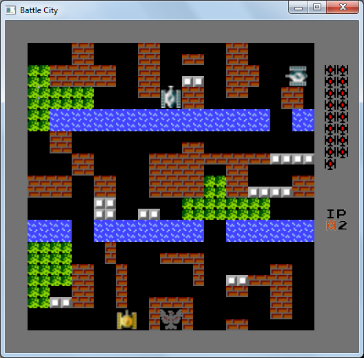
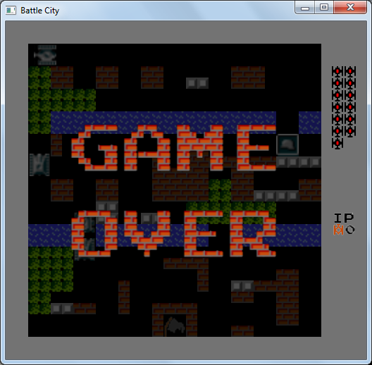

# Battle City remake on Haskell

A complete (!) clone of the Battle City game, written in Haskell.

## Dependencies
- `cabal update`
- `cabal install glut`
- `cabal install random-shuffle`

## Control
- `A`, `S`, `D`, `W` - movement.
- `Space` - shooting.
- `P` - pause.

## Screenshots

